# CCNA Portfolio Project 02 – Multi-Site Branch Network

**Client:** Ellis Distribution Group  
**Designed by:** Raymond Ellis  
**Platform:** Cisco Packet Tracer 9.0

## Project Overview

This project implements a secure, routed network connecting the headquarters of Ellis Distribution Group with two branch locations. The network uses a hub-and-spoke design, point-to-point `/30` WAN subnets, static IPv4 routing, and SSH version 2 for secure remote router management.

The completed environment provides end-to-end communication between all three LANs while demonstrating IP address planning, router configuration, route verification, secure administration, connectivity testing, and structured troubleshooting.

## Final Topology

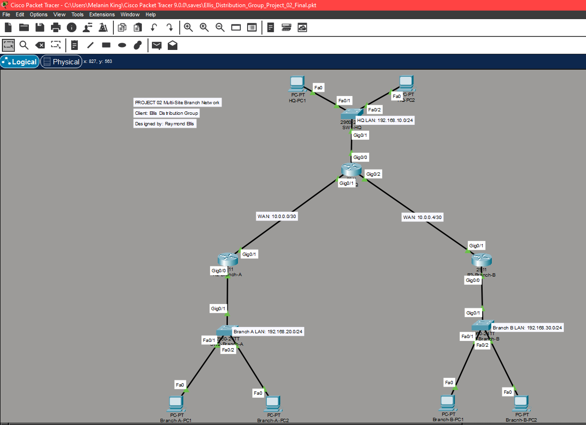

## Project Objectives

- Build a three-site hub-and-spoke network.
- Connect HQ, Branch A, and Branch B through routed WAN links.
- Assign `/24` networks to the three LANs.
- Use efficient `/30` addressing on point-to-point WAN connections.
- Configure static routes for all remote LANs.
- Enable SSH version 2 and restrict remote router access to SSH.
- Verify connectivity using ping, traceroute, routing tables, and remote SSH sessions.
- Diagnose and repair a simulated missing-route failure.
- Document the design, configuration, testing, and resolution process.

## Network Equipment

| Device type | Quantity | Model/role |
|---|---:|---|
| Router | 3 | Cisco 2911: R1-HQ, R2-BRANCH-A, R3-BRANCH-B |
| Switch | 3 | Cisco 2960: one access switch per site |
| PC | 6 | Two endpoint devices per site |

## IP Addressing Plan

### Router Interfaces

| Device | Interface | IP address | Subnet mask | Purpose |
|---|---|---|---|---|
| R1-HQ | G0/0 | 192.168.10.1 | 255.255.255.0 | HQ default gateway |
| R1-HQ | G0/1 | 10.0.0.1 | 255.255.255.252 | WAN to Branch A |
| R1-HQ | G0/2 | 10.0.0.5 | 255.255.255.252 | WAN to Branch B |
| R2-BRANCH-A | G0/0 | 192.168.20.1 | 255.255.255.0 | Branch A default gateway |
| R2-BRANCH-A | G0/1 | 10.0.0.2 | 255.255.255.252 | WAN to HQ |
| R3-BRANCH-B | G0/0 | 192.168.30.1 | 255.255.255.0 | Branch B default gateway |
| R3-BRANCH-B | G0/1 | 10.0.0.6 | 255.255.255.252 | WAN to HQ |

### End Devices

| Device | IP address | Subnet mask | Default gateway |
|---|---|---|---|
| HQ-PC1 | 192.168.10.10 | 255.255.255.0 | 192.168.10.1 |
| HQ-PC2 | 192.168.10.11 | 255.255.255.0 | 192.168.10.1 |
| BRANCH-A-PC1 | 192.168.20.10 | 255.255.255.0 | 192.168.20.1 |
| BRANCH-A-PC2 | 192.168.20.11 | 255.255.255.0 | 192.168.20.1 |
| BRANCH-B-PC1 | 192.168.30.10 | 255.255.255.0 | 192.168.30.1 |
| BRANCH-B-PC2 | 192.168.30.11 | 255.255.255.0 | 192.168.30.1 |

### WAN Subnets

| Connection | Network | Usable addresses | Broadcast |
|---|---|---|---|
| HQ to Branch A | 10.0.0.0/30 | 10.0.0.1–10.0.0.2 | 10.0.0.3 |
| HQ to Branch B | 10.0.0.4/30 | 10.0.0.5–10.0.0.6 | 10.0.0.7 |

## Static Routing Design

| Router | Remote destination | Next hop |
|---|---|---|
| R1-HQ | 192.168.20.0/24 | 10.0.0.2 |
| R1-HQ | 192.168.30.0/24 | 10.0.0.6 |
| R2-BRANCH-A | 192.168.10.0/24 | 10.0.0.1 |
| R2-BRANCH-A | 192.168.30.0/24 | 10.0.0.1 |
| R3-BRANCH-B | 192.168.10.0/24 | 10.0.0.5 |
| R3-BRANCH-B | 192.168.20.0/24 | 10.0.0.5 |

### Routing Table Verification

#### R1-HQ

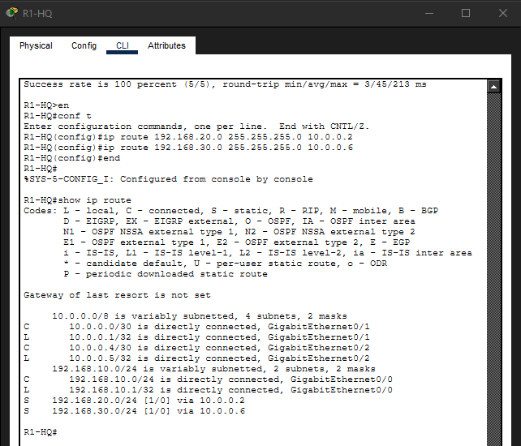

#### R2-BRANCH-A

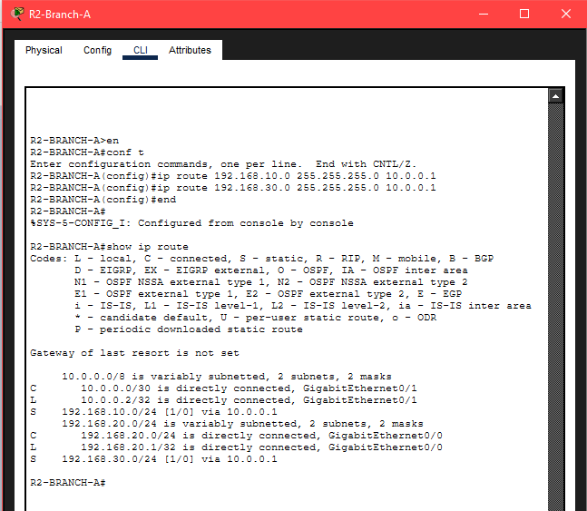

#### R3-BRANCH-B

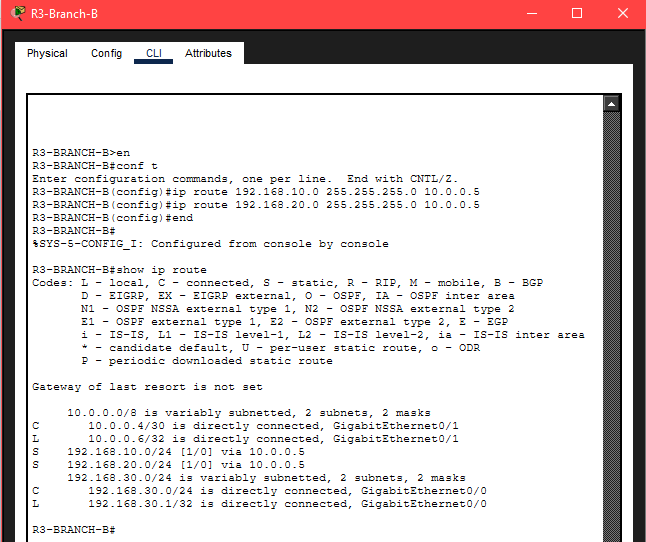

## Secure Remote Management

All three routers were configured for secure remote administration using:

- SSH version 2
- RSA keys
- Local privilege-15 authentication
- Encrypted enable and user secrets
- VTY lines restricted to SSH with `transport input ssh`
- An authorized-access MOTD banner
- A local domain name of `ellis.local`

Authentication credentials were intentionally removed from the public configuration files.

### Local HQ SSH Verification

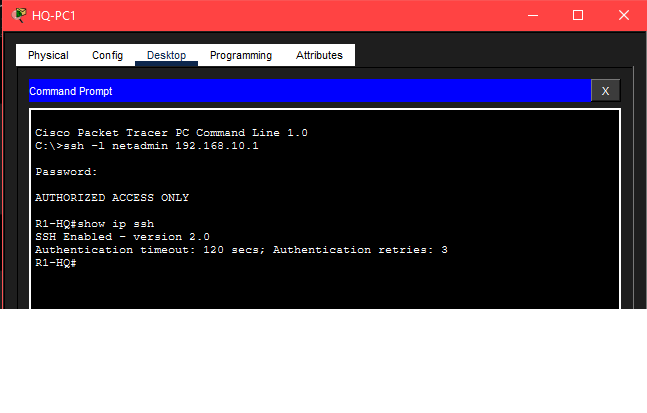

### Cross-Site SSH Verification

The following test demonstrates secure router management from HQ across the routed WAN connection to Branch A.

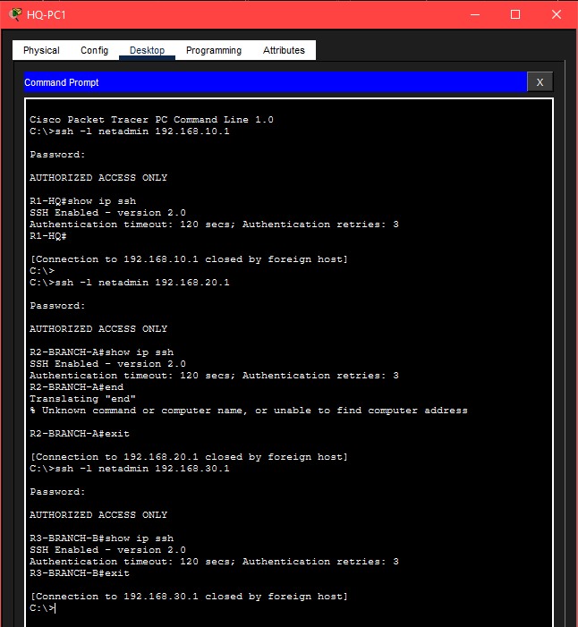

## Connectivity Testing

### End-to-End Ping Testing

HQ-PC1 successfully reached endpoint devices in both branch networks with zero packet loss.

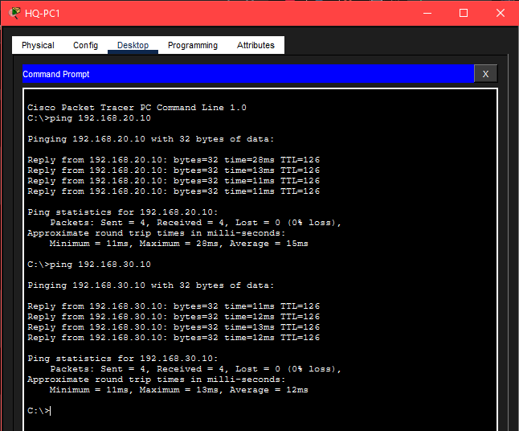

### Cross-Site Traceroute

A traceroute from Branch A to Branch B confirmed that traffic traversed R2-BRANCH-A, R1-HQ, and R3-BRANCH-B before reaching the destination endpoint.

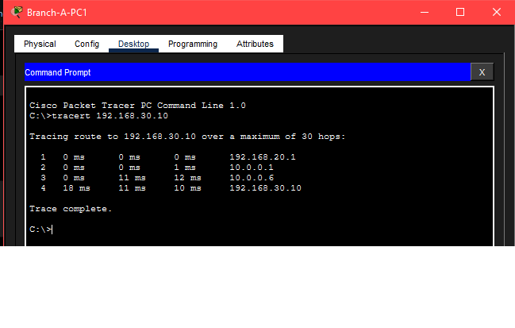

## Troubleshooting Demonstration

### Incident

Branch A retained connectivity to HQ but could no longer reach Branch B. This isolated the problem to a specific remote destination rather than a complete LAN or WAN outage.

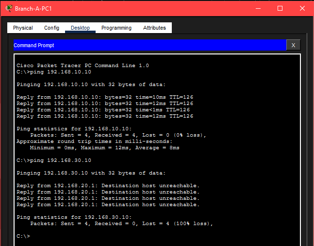

### Diagnosis

R2-BRANCH-A interfaces remained operational, and its WAN next hop at `10.0.0.1` was reachable. Examination of the routing table showed that `192.168.30.0/24` was missing, identifying the absent static route as the cause.

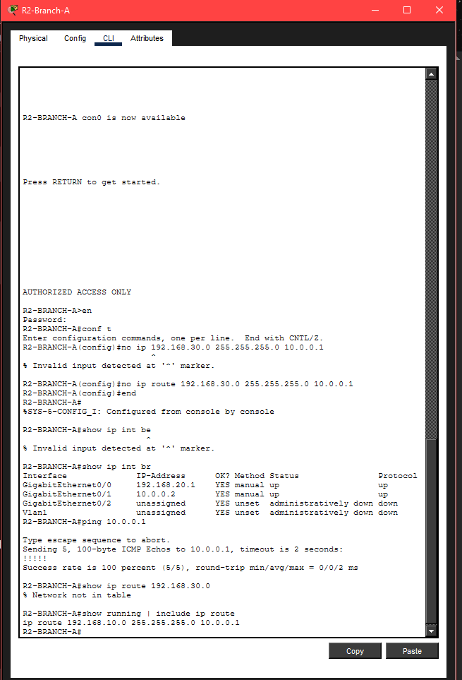

### Resolution

The missing route was restored on R2-BRANCH-A:

```cisco
ip route 192.168.30.0 255.255.255.0 10.0.0.1
```

After the repair, Branch A regained full connectivity to Branch B with zero packet loss.

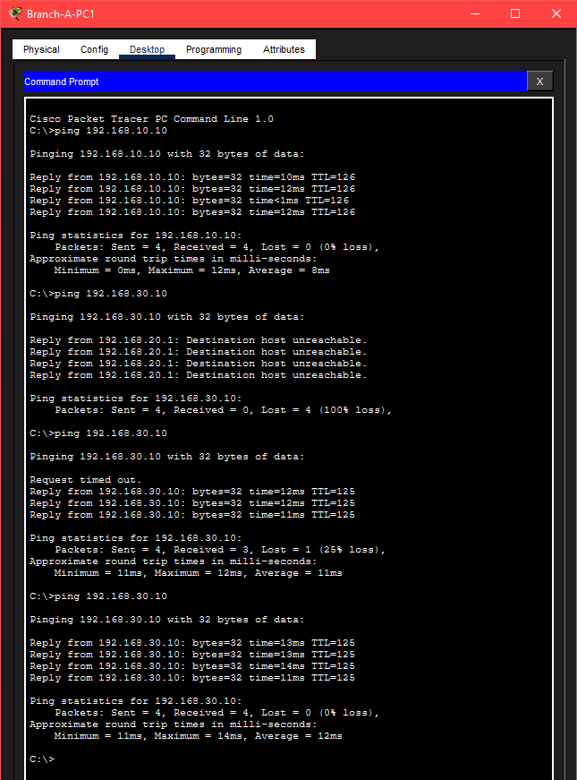

## Configuration Files

- [R1-HQ running configuration](Configs/R1-HQ-running-config.txt)
- [R2-BRANCH-A running configuration](Configs/R2-BRANCH-A-running-config.txt)
- [R3-BRANCH-B running configuration](Configs/R3-BRANCH-B-running-config.txt)

## Packet Tracer File

- [Download the completed Packet Tracer project](Ellis_Distribution_Group_Project_02_Final.pkt)

## Skills Demonstrated

- IPv4 addressing and subnetting
- `/24` LAN and `/30` point-to-point network design
- Cisco IOS router interface configuration
- Hub-and-spoke WAN design
- Static route configuration and verification
- Routing-table interpretation
- Secure SSH version 2 administration
- Ping and traceroute analysis
- Layered network troubleshooting
- Technical documentation and evidence collection

## Project Outcome

The completed network provides reliable communication between headquarters and both branch locations. Static routing delivers full reachability across the hub-and-spoke topology, SSH provides secure administrative access, and the troubleshooting exercise demonstrates the ability to isolate and repair an IP-routing failure methodically.

---

**Designed and documented by Raymond Ellis**
